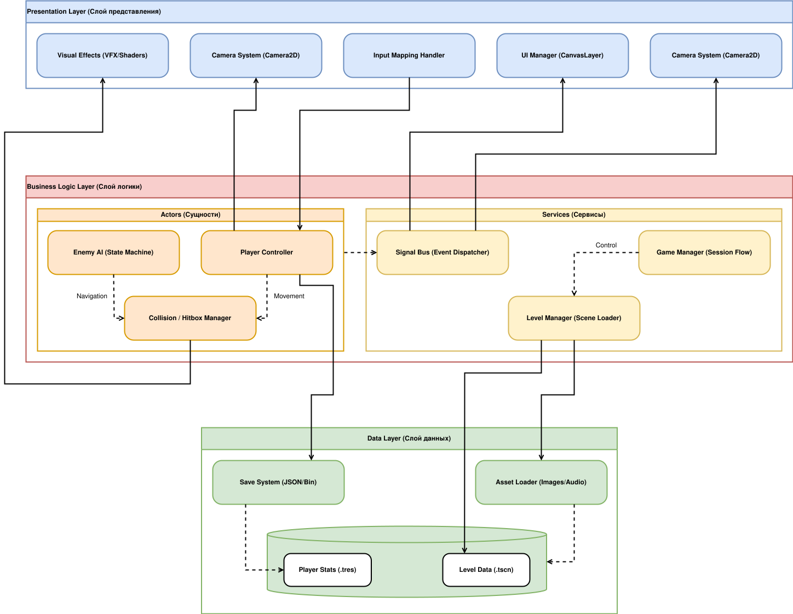

# Проектирование целевой архитектуры проекта (To Be)
**Проект:** 2D Платформер "SKoG"  
**Статус:** Лабораторная работа №3  
**Методология:** Microsoft Application Architecture Guide (2nd Edition)

---

## 1. Определение типа приложения
В соответствии с классификацией Microsoft, проект определяется как **Rich Client Application** (Насыщенное клиентское приложение).

* **Обоснование:** Приложение требует относительно высокой производительности для рендеринга графики в реальном времени, мгновенного отклика на ввод пользователя и локального управления ресурсами. 
* **Ключевые характеристики:**  
    1. Локальная обработка игрового цикла (Game Loop).
    2. Интенсивное использование графического процессора (GPU) через API движка Godot.
    3. Полная автономность бизнес-логики (физика, ИИ) без зависимости от сетевых сервисов.

## 2. Стратегия развёртывания
Выбрана стратегия **Standalone Deployment** (Автономное развертывание).

* **Метод:** Компиляция исходного кода и ресурсов в единый исполняемый пакет (.exe / .bin) с использованием системы экспорта Godot.
* **Преимущества:** Минимизация задержек (latency), отсутствие зависимости от интернет-соединения и полный контроль над версиями используемых библиотек.
* **Целевые платформы:** Настольные системы (Windows, Linux), что позволяет задействовать аппаратное ускорение и локальные файловые системы.

## 3. Обоснование выбора технологии
Выбор технологического стека базируется на принципах модульности и эффективности разработки:

* **Godot Engine 4.6:** Движок с открытым исходным кодом, реализующий паттерн **Composite** (система узлов и сцен), что идеально соответствует принципу разделения ответственности.
* **GDScript:** Высокоуровневый объектно-ориентированный язык, оптимизированный для быстрой разработки игровых механик.
* **Система ресурсов (.tres):** Позволяет отделить данные (параметры игрока, характеристики врагов) от логики, что упрощает поддержку и балансировку игры.

## 4. Показатели качества (Quality Attributes)
На основе главы 16 руководства Microsoft, приоритетными атрибутами качества являются:

* **Performance (Производительность):** Поддержание стабильной частоты кадров (Target: 60 FPS). Эффективное использование пула объектов (Object Pooling) для снарядов и частиц.
* **Maintainability (Удобство сопровождения):** Четкое разделение кода и ассетов. Соблюдение стандартов кодирования Godot Style Guide.
* **Extensibility (Расширяемость):** Архитектура «Плагин-узел», позволяющая добавлять новые типы врагов или уровней без изменения ядра системы.
* **Usability (Удобство использования):** Минимальное время загрузки и интуитивно понятное управление.

## 5. Сквозная функциональность (Cross-cutting Concerns)
Задачи, пронизывающие все слои приложения, реализуются через централизованные механизмы:

* **Управление состоянием (State Management):** Реализуется через **Autoload (Singleton)**. Глобальные данные (счет, инвентарь) хранятся в отдельном узле, доступном из любой сцены.
* **Конфигурирование:** Использование встроенных настроек проекта (`ProjectSettings`) для управления графикой и вводом.
* **Обработка исключений:** Многоуровневая проверка состояний через `assert` и `push_error` для предотвращения критических сбоев при загрузке уровней.
* **Логирование:** Выделенный модуль для записи событий игры, упрощающий отладку поведения ИИ.

## 6. Структурная схема приложения (To Be)
Архитектура «To Be» разделена на функциональные слои с четко определенными связями:

### Слой представления (Presentation Layer)
* **UI/HUD:** Отрисовка интерфейса пользователя, полосок здоровья и меню.
* **Render Engine:** Визуализация 2D-спрайтов, фонов и спецэффектов.
* **Input Map:** Трансляция аппаратных сигналов в логические команды (Jump, Move, Attack).

### Слой игровой логики (Business Logic Layer)
* **Actor Logic:** Физика движения игрока, расчет коллизий.
* **AI Engine:** Логика поведения врагов (патрулирование, преследование).
* **Level Management:** Обработка событий уровня, триггеров и переходов между локациями.

### Слой данных (Data Layer)
* **Resource Management:** Система загрузки и кэширования графических и звуковых ресурсов.
* **Storage Access:** Сериализация игрового прогресса в форматы JSON или ConfigFile.

---

### Место для схем и диаграмм:

---

## Вывод части №1
Проектируемая архитектура «To Be» ориентирована на создание слабосвязанной системы, где визуальная часть полностью отделена от логических расчетов, а данные вынесены в независимые ресурсы. Это соответствует рекомендациям Microsoft по проектированию масштабируемых и производительных приложений, обеспечивая фундамент для дальнейшей разработки в рамках Sprint 1-3.