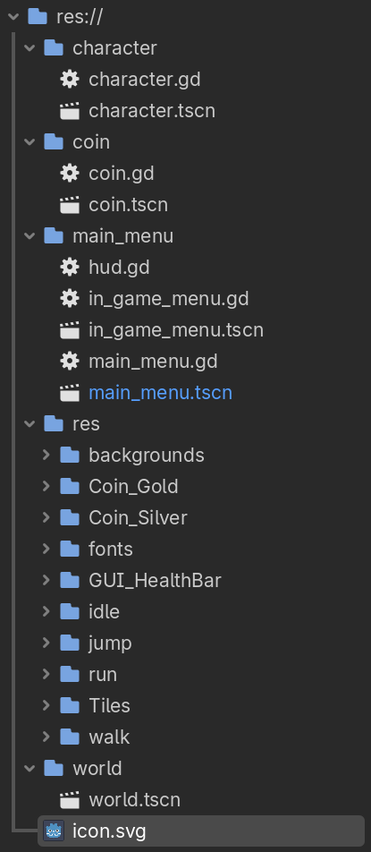
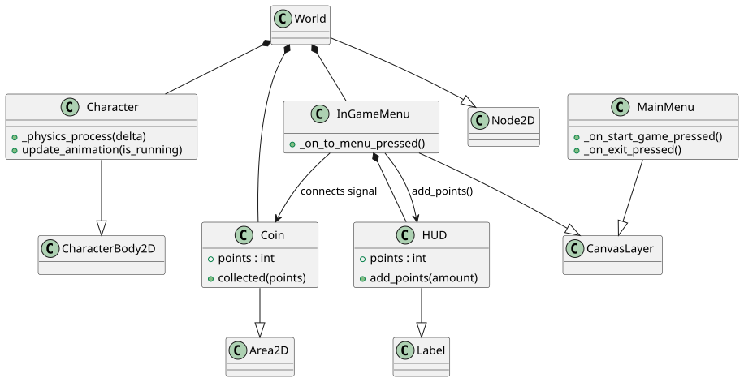

# Исследование архитектурного решения
**Проект:** 2D Платформер "SKoG"  
**Лабораторная работа №3**  
**Методология:** Microsoft Application Architecture Guide (2nd Edition)

---

<h1 style="border-bottom: none;">Часть №1: Проектирование архитектуры</h1>   

## 1. Определение типа приложения
В соответствии с классификацией Microsoft, проект определяется как **Rich Client Application** (Насыщенное клиентское приложение).

* **Обоснование:** Приложение требует относительно высокой производительности для рендеринга графики в реальном времени, мгновенного отклика на ввод пользователя и локального управления ресурсами. 
* **Ключевые характеристики:**  
    1. Локальная обработка игрового цикла (Game Loop).
    2. Интенсивное использование графического процессора (GPU) через API движка Godot.
    3. Полная автономность бизнес-логики (физика, ИИ) без зависимости от сетевых сервисов.

## 2. Стратегия развёртывания
Выбрана стратегия **Standalone Deployment** (Автономное развертывание).

* **Метод:** Компиляция исходного кода и ресурсов в единый исполняемый пакет (.exe / .bin) с использованием системы экспорта Godot.
* **Преимущества:** Минимизация задержек (latency), отсутствие зависимости от интернет-соединения и полный контроль над версиями используемых библиотек.
* **Целевые платформы:** Настольные системы (Windows, Linux), что позволяет задействовать аппаратное ускорение и локальные файловые системы.

## 3. Обоснование выбора технологии
Выбор технологического стека базируется на принципах модульности и эффективности разработки:

* **Godot Engine 4.6:** Движок с открытым исходным кодом, реализующий паттерн **Composite** (система узлов и сцен), что идеально соответствует принципу разделения ответственности.
* **GDScript:** Высокоуровневый объектно-ориентированный язык, оптимизированный для быстрой разработки игровых механик.
* **Система ресурсов (.tres):** Позволяет отделить данные (параметры игрока, характеристики врагов) от логики, что упрощает поддержку и балансировку игры.

## 4. Показатели качества (Quality Attributes)
На основе главы 16 руководства Microsoft, приоритетными атрибутами качества являются:

* **Performance (Производительность):** Поддержание стабильной частоты кадров (Target: 60 FPS). Эффективное использование пула объектов (Object Pooling) для снарядов и частиц.
* **Maintainability (Удобство сопровождения):** Четкое разделение кода и ассетов. Соблюдение стандартов кодирования Godot Style Guide.
* **Extensibility (Расширяемость):** Архитектура «Плагин-узел», позволяющая добавлять новые типы врагов или уровней без изменения ядра системы.
* **Usability (Удобство использования):** Минимальное время загрузки и интуитивно понятное управление.

## 5. Сквозная функциональность (Cross-cutting Concerns)
Задачи, пронизывающие все слои приложения, реализуются через централизованные механизмы:

* **Управление состоянием (State Management):** Реализуется через **Autoload (Singleton)**. Глобальные данные (счет, инвентарь) хранятся в отдельном узле, доступном из любой сцены.
* **Конфигурирование:** Использование встроенных настроек проекта (`ProjectSettings`) для управления графикой и вводом.
* **Обработка исключений:** Многоуровневая проверка состояний через `assert` и `push_error` для предотвращения критических сбоев при загрузке уровней.
* **Логирование:** Выделенный модуль для записи событий игры, упрощающий отладку поведения ИИ.

## 6. Структурная схема приложения (To Be)
Архитектура «To Be» разделена на функциональные слои с четко определенными связями:

### Слой представления (Presentation Layer)
* **UI/HUD:** Отрисовка интерфейса пользователя, полосок здоровья и меню.
* **Render Engine:** Визуализация 2D-спрайтов, фонов и спецэффектов.
* **Input Map:** Трансляция аппаратных сигналов в логические команды (Jump, Move, Attack).

### Слой игровой логики (Business Logic Layer)
* **Actor Logic:** Физика движения игрока, расчет коллизий.
* **AI Engine:** Логика поведения врагов (патрулирование, преследование).
* **Level Management:** Обработка событий уровня, триггеров и переходов между локациями.

### Слой данных (Data Layer)
* **Resource Management:** Система загрузки и кэширования графических и звуковых ресурсов.
* **Storage Access:** Сериализация игрового прогресса в форматы JSON или ConfigFile.

---

### Диаграмма структуры приложения:

---

## Вывод части №1
Проектируемая архитектура «To Be» ориентирована на создание слабосвязанной системы, где визуальная часть полностью отделена от логических расчетов, а данные вынесены в независимые ресурсы. Это соответствует рекомендациям Microsoft по проектированию масштабируемых и производительных приложений, обеспечивая фундамент для дальнейшей разработки в рамках Sprint 1-3.

---

<h1 style="border-bottom: none;">Часть №2: Анализ архитектуры</h1>  

## Часть 2. Анализ архитектуры (As Is)

В данном разделе представлен анализ текущей реализации системы на момент завершения первого этапа разработки. Текущее состояние проекта - функциональный прототип, включающий базовые механики перемещения игрока и систему сбора предметов (монеток).

### Описание текущей реализации
На текущем этапе архитектура проекта является монолитной и сильно связанной. Основные сущности системы реализованы в виде отдельных сцен, содержащих в себе как логику, так и данные.

**Текущие компоненты системы:**
1.  **Player (Персонаж):** Узел `CharacterBody2D`, содержащий скрипт `player.gd`. В одном файле совмещены:
    * Обработка ввода (Input Handling).
    * Физика перемещения и прыжков.
    * Логика коллизий с окружением и монетками.
2.  **Coin (Монетка):** Узел `Area2D` со скриптом `coin.gd`. Реализует простую проверку вхождения тела (body_entered) и самоудаление при контакте с игроком.
3.  **Main (Уровень):** Корневая сцена, где экземпляры персонажа и монеток размещены вручную.

### Результаты обратной инженерии (Анализ классов)
Для визуализации текущей архитектуры использован метод декомпозиции существующих скриптов. Основные характеристики архитектуры «As Is»:

* **Сцепленность (Coupling):** Персонаж напрямую взаимодействует с узлами монеток. Отсутствует промежуточный слой (Event Bus или Game Manager), который мог бы обрабатывать события сбора предметов.
* **Отсутствие инкапсуляции данных:** Текущее количество собранных монет хранится непосредственно в переменной внутри скрипта игрока, что делает эти данные недоступными для других систем (например, будущего UI) без создания жестких ссылок.

> **Примечание:** Ввиду ранней стадии разработки и использования Godot Engine, используется анализ древа узлов и визуализациея связей через PlantUML.

---

---

<h1 style="border-bottom: none;">Часть №3: Сравнениие и рефакторинг</h1>  

В данном разделе проводится сопоставление текущей реализации (**As Is**) с целевой архитектурой (**To Be**). Сравнение выполняется на уровне системных компонентов и принципов взаимодействия между ними.

### 1. Сравнение архитектур «As is» и «To be»

Для анализа выбраны сопоставимые уровни детализации: взаимодействие игровых сущностей и управление состоянием игры.

| Характеристика | Текущее состояние (As Is) | Целевое состояние (To Be) |
| :--- | :--- | :--- |
| **Связность (Coupling)** | **Сильная.** Скрипт монетки напрямую обращается к узлу игрока (через коллизию). | **Слабая.** Взаимодействие через абстрактную шину сигналов (Signal Bus). |
| **Управление состоянием** | **Децентрализованное.** Счетчик монет хранится внутри переменной. | **Централизованное.** Состояние хранится в Game Manager / Ресурсах данных. |
| **Обработка событий** | **Императивная.** Один объект напрямую вызывает методы другого. | **Реактивная.** Объекты генерируют сигналы, на которые подписываются заинтересованные системы (UI, Sound). |
| **Масштабируемость** | **Низкая.** Добавление новых типов бонусов требует дублирования логики в коде игрока. | **Высокая.** Новые элементы добавляются как независимые компоненты, работающие по общему протоколу. |

### 2. Отличия и анализ их причин

Основные архитектурные отличия вызваны необходимостью устранения недостатков текущего прототипа:

1.  **Выделение бизнес-логики из физических объектов:**
    * *Причина:* В «As Is» сбор монетки жестко привязан к физике. Если мы захотим добавить "магнит для монет", придется переписывать код и игрока, и монетки. В «To Be» логика сбора вынесена в отдельный слой сервисов.
2.  **Инверсия управления (IoC):**
    * *Причина:* Сейчас игрок «управляет» обновлением данных. В целевой архитектуре используется принцип инверсии: игрок лишь уведомляет систему о факте столкновения, а «что делать дальше» решает менеджер уровня.
3.  **Изоляция интерфейса (UI):**
    * *Причина:* На текущем этапе добавление полоски прогресса потребует прямой ссылки из скрипта игрока на текстовое поле UI. Это делает компоненты невозможными для тестирования по отдельности.

### 3. Пути улучшения архитектуры

На основе принципов проектирования и рекомендаций Microsoft Application Architecture Guide, определены следующие пути развития системы:

* **Применение шаблона "Observer" (Наблюдатель):**
    Внедрение глобального синглтона `SignalBus`. Это позволит полностью исключить прямые зависимости (`get_node`) между игроком, монетами и интерфейсом.
* **Использование шаблона "State" (Состояние):**
    Перевод логики игрока с набора `if/else` на иерархическую машину состояний (Finite State Machine). Это упростит добавление новых механик (рывок, атака) без риска сломать базовое движение.
* **Разделение на слои (Layered Architecture):**
    * *Presentation Layer:* Только визуализация (спрайты, анимации, частицы).
    * *Domain Layer:* Правила игры (расчет скорости, логика подбора предметов).
    * *Data Layer:* Хранение прогресса (ресурсы `.tres`, система сохранений).
* **Принцип единственной ответственности (Single Responsibility):**
    Скрипт `player.gd` будет разделен на компоненты: `InputHandler` (ввод), `Mover` (физика) и `Stats` (данные), что соответствует стандартам чистого кода.

---

**Вывод:**
Переход от монолитной архитектуры «As Is» к модульной «To Be» позволит проекту выйти за рамки простого прототипа. Это обеспечит надежность системы при добавлении новых игровых уровней и типов противников, а также значительно упростит процесс отладки за счет четкого разделения зон ответственности компонентов.

