# Лабораторная работа №6: Улучшение UX

## Атрибуты качества ПО группы “Usability” (согласно ISO/IEC 25010:2011)

1. **Распознаваемость соответствия:** Степень, в которой пользователи могут распознать, подходит ли продукт для их нужд на основе первоначальной документации, демонстрации или информации.
2. **Обучаемость:** Степень, в которой продукт позволяет пользователям эффективно и результативно обучаться его использованию.
3. **Используемость (операбельность):** Степень, в которой продукт может быть использован для достижения целей с эффективностью, производительностью и удовлетворением в указанном контексте использования.
4. **Эстетика GUI:** Степень, в которой интерфейс пользователя обеспечивает приятное и удовлетворяющее взаимодействие.
5. **Доступность:** Степень, в которой продукт может быть использован людьми с самыми широкими возможностями и ограничениями для достижения целей.

## Требования и стандарты

* Microsoft Usability Guidelines  
* Apple Human Interface Guidelines  
* Google Material Design  
* WCAG 2.0 (адаптация для игр)

## Уровни “Опыта использования” (по модели Джесса Гарретта)

1. **Уровень поверхности:** Внешний вид продукта (текст, изображения, кнопки и т.д.).  
2. **Уровень компоновки:** Конкретная реализация структуры (эффективное расположение элементов UI).  
3. **Уровень структуры:** Взаимное расположение страниц, форм, окон (навигация: "откуда", "куда", "как").  
4. **Уровень набора возможностей:** Перечисление функциональных возможностей.  
5. **Уровень стратегии:** Абстрактный уровень желаний и ожиданий пользователей и заказчика.

---

## 1. Оценка разрабатываемого ПО по атрибутам

Разрабатываемое ПО — 2D игра **SKoG** на Godot 4.  

* **Распознаваемость соответствия:** Средняя. Пользователь видит игровую сцену и меню. **Оценка: 7/10**.  
* **Обучаемость:** Средняя. Игровой процесс простой, но игроки, которые впервые играют, могут не сразу понять функционал сохранений и карты. **Оценка: 6/10**.  
* **Используемость (операбельность):** Хорошая. Управление персонажем и меню работают плавно. Возможность 3 слотов сохранений, отображение уровня и масштабируемость карты повышают удобство. **Оценка: 8/10**.  
* **Эстетика GUI:** Высокая. Переработанное меню, туман и карта с улучшенной визуализацией создают атмосферу. **Оценка: 9/10**.  
* **Доступность:** Средняя. Игра визуально приятная, но не поддерживает масштабирование интерфейса элементов HUD и текста. **Оценка: 5/10**.

---

## 2. Выбор путей улучшения UX, обоснование необходимости

* **Улучшение 1:** Удаление кнопки паузы в углу.  
  **Обоснование:** Снижает визуальный шум, упрощает интерфейс, повышает эстетичность.  

* **Улучшение 2:** Добавление тумана в игровом процессе.  
  **Обоснование:** Повышает погружение и эстетику GUI.  

* **Улучшение 3:** Переработка главного меню.  
  **Обоснование:** Улучшает компоновку и визуальное восприятие, делает навигацию интуитивной и приятнее.  

* **Улучшение 4:** Возможность 3 слотов сохранений.  
  **Обоснование:** Игрок может создавать несколько сохранений, повышая гибкость использования.  

* **Улучшение 5:** Отображение уровня игрока в каждом слоте сохранения.  
  **Обоснование:** Позволяет сразу видеть прогресс и текущий уровень без загрузки.  

* **Улучшение 6:** Сокрытие номера следующего уровня на карте до прохождения текущего.  
  **Обоснование:** Улучшает структуру и последовательность прохождения уровней, делает игровой процесс логичным и добавляет интерес изведать неизвестное.  

* **Улучшение 7:** Масштабируемость карты.  
  **Обоснование:** Игрок может увеличивать или уменьшать вид карты, повышая удобство навигации и контроля ситуации.

---

## 3. Проведенные улучшения

**Улучшение 1: Удаление кнопки паузы**  
* До: Кнопка паузы занимала часть экрана, отвлекала внимание.  
* После: Пауза вызывается клавишей `Esc`, кнопка убрана с HUD.

**Улучшение 2: Туман в игровом процессе**  
* До: Сцена без атмосферных эффектов.  
* После: Добавлен динамический туман, создающий глубину сцены.

**Улучшение 3: Переработка главного меню**  
* До: Простое меню с текстовыми кнопками.  
* После: Иконки, визуальные эффекты при наведении, улучшенная компоновка.

**Улучшение 4: Система 3 слотов сохранений**  
* До: Одно сохранение.  
* После: Игрок может использовать три слота сохранений.

**Улучшение 5: Отображение уровня игрока в каждом слоте сохранения**  
* До: Прогресс не отображался.  
* После: На каждом слоте видно, на каком уровне игрок остановился.

**Улучшение 6: Сокрытие номера следующего уровня на карте**  
* До: Все номера уровней видны с самого начала.  
* После: Номер следующего уровня появляется только после прохождения текущего.

**Улучшение 7: Масштабируемость карты**  
* До: Статичный размер карты.  
* После: Игрок может увеличивать/уменьшать карту для удобства навигации.

---

## 4. Картинки/описания “до” vs. “после”

**Улучшение 1: Удаление кнопки паузы**  
* До: 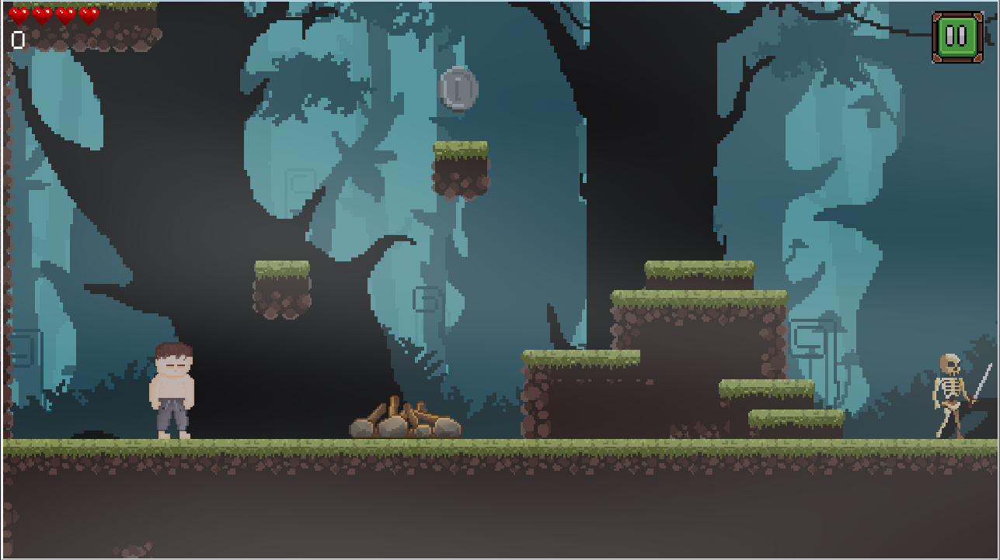  
* После: 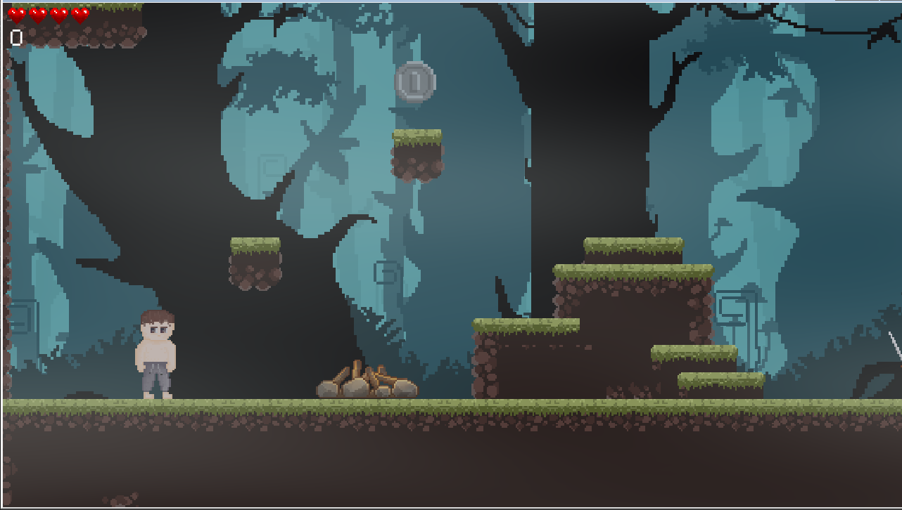  

**Улучшение 2: Туман в игровом процессе**  
* До: 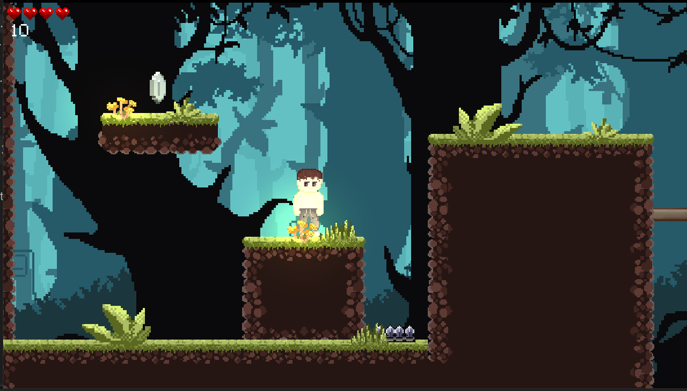  
* После: 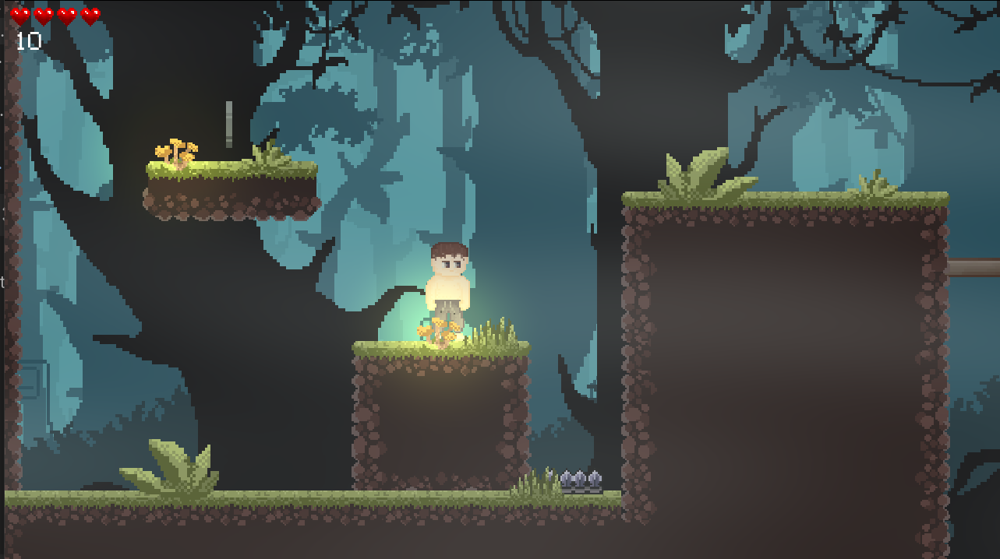  

**Улучшение 3: Переработка главного меню**  
* До: 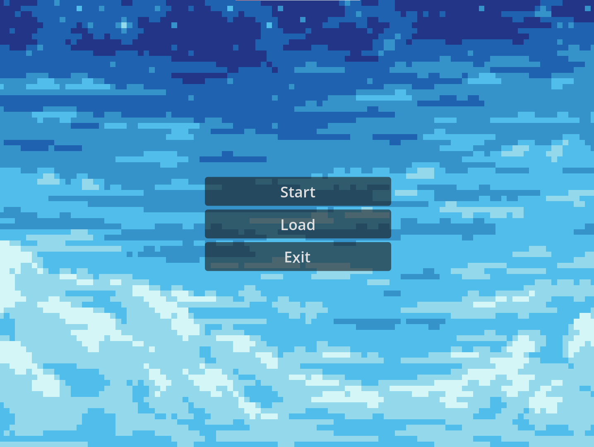  
* После: 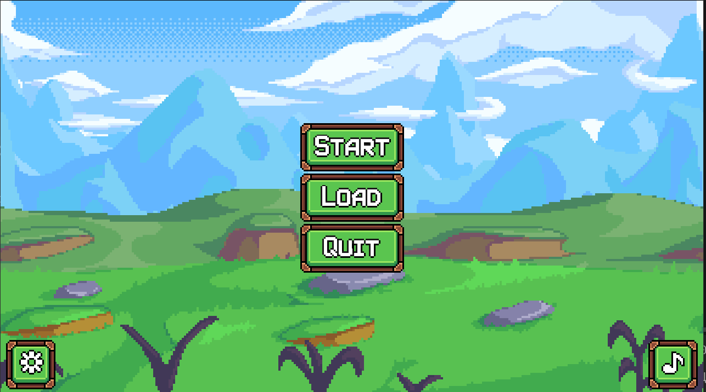  

**Улучшение 4: Возможность 3 слотов сохранений**  
* До: 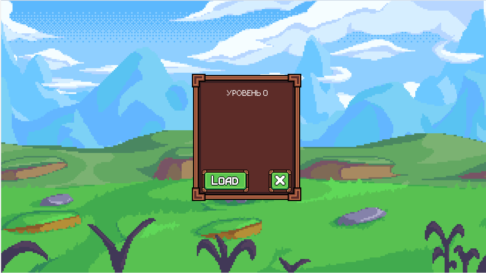  
* После: 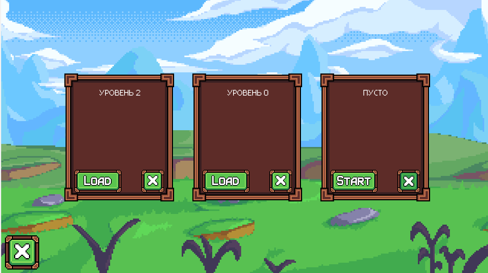  

**Улучшение 5: Отображение уровня игрока в каждом слоте сохранения**  
* До: 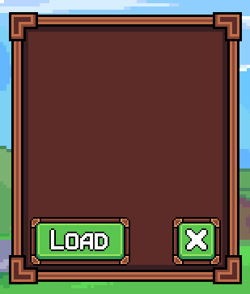  
* После: 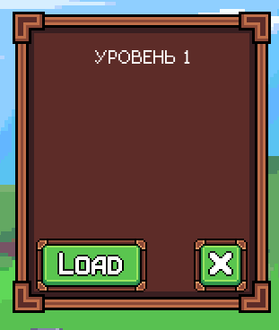  

**Улучшение 6: Сокрытие номера следующего уровня на карте**  
* До: 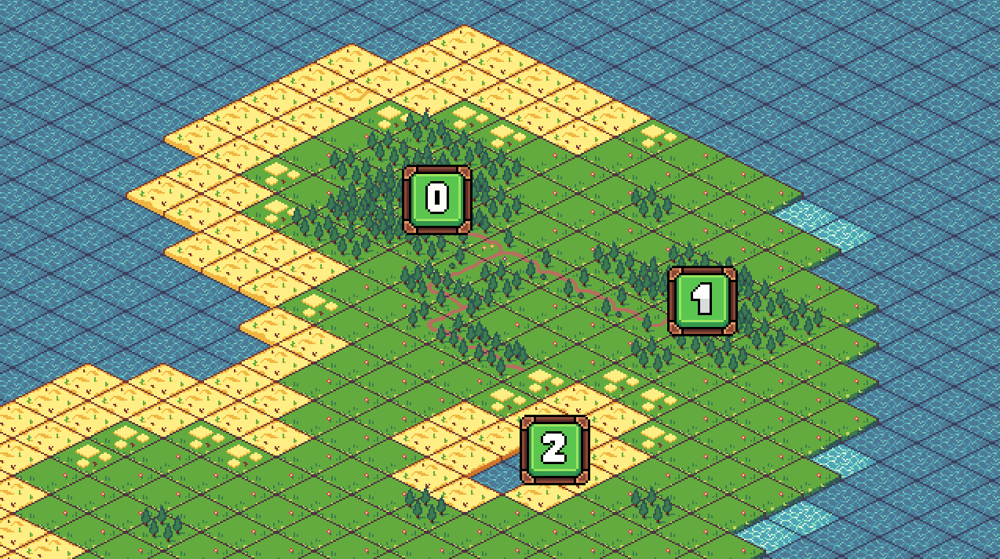  
* После: 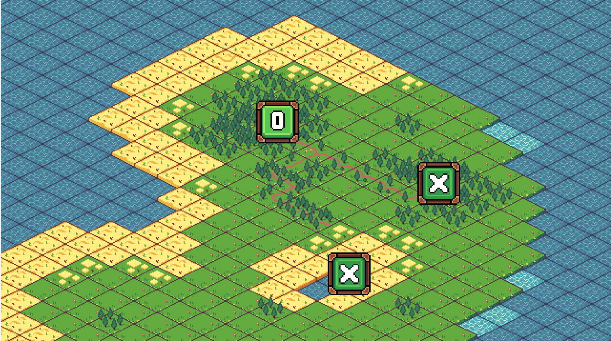  

**Улучшение 7: Масштабируемость карты**  
* До:   
* После: 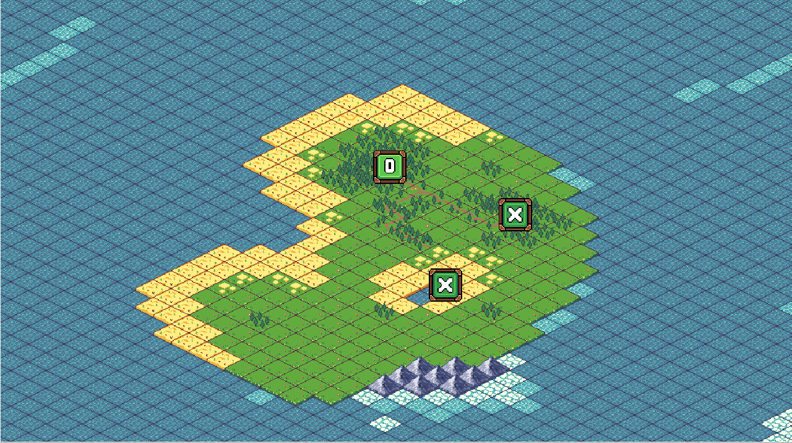  

---

## Заключение

Внесенные улучшения повысили usability игры **SKoG**:

* Повышена эстетика GUI и атмосфера игры (туман, переработанное меню).  
* Улучшена структура и визуализация прогресса (система слотов сохранений, отображение уровня, сокрытие следующего уровня).  
* Добавлена масштабируемость карты для удобной навигации.  
* Убрана отвлекающая кнопка паузы.  

Общий UX оценен выше, особенно по атрибутам эстетика GUI, используемость и обучаемость.